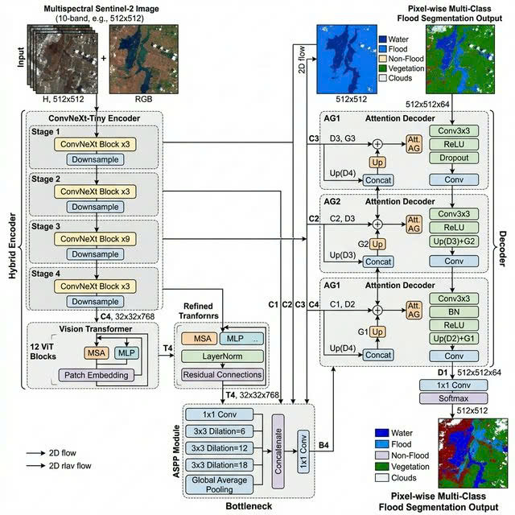

# 🌊 FloodSeg AI: Flood Segmentation API

[](https://fastapi.tiangolo.com/)
[](https://nextjs.org/)
[](https://pytorch.org/)
[](https://www.docker.com/)

**FloodSeg AI** is a full-stack deep learning solution for automated flood segmentation. It utilizes a state-of-the-art **ViT-UNet** architecture with a **ConvNeXt-Tiny** backbone to accurately identify water bodies, flooded infrastructure, and other terrain features from aerial or satellite imagery.

## Interface Demo


---

## Key Features

- **Multi-class Classification (10 classes):** Beyond simple flood detection, the model classifies Buildings, Roads, Water, Trees, Vehicles, Pools, Grass, and specifically identifies **Flooded Buildings** & **Flooded Roads**.
- **Modern Hybrid Architecture:** Combines the powerful feature extraction of ConvNeXt with the global context capturing capabilities of Transformers (ViT).
- **Interactive Interface:** A Next.js dashboard that allows image uploads, mask overlay viewing, opacity control, and direct comparison with the original image.
- **High Performance:** Optimized for fast inference on both CPU and GPU, returning precise JSON mask data.
- **Docker Ready:** Easily deployable across any platform supporting containers.

---

## Tech Stack

| Component | Technology |
| :--- | :--- |
| **Backend** | Python, FastAPI, PyTorch, Timm, OpenCV |
| **Frontend** | Node.js, Next.js 15, TypeScript, TailwindCSS, Lucide React |
| **AI Model** | ViT-UNet (Hybrid Architecture), ConvNeXt-Tiny Backbone |
| **Deployment** | Docker, Vercel (Frontend), Render/Hugging Face (Backend) |

---

## Model Architecture (ViT-UNet)

The system uses a hybrid variant of UNet, specifically designed for complex segmentation tasks:

1.  **Encoder:** Uses **ConvNeXt-Tiny** (pre-trained) as the backbone to extract multi-level feature maps.
2.  **Transformer Bottleneck:** At the deepest level, features are processed through Transformer Blocks to capture long-range spatial dependencies.
3.  **ASPP (Atrous Spatial Pyramid Pooling):** Helps the model understand context at multiple scales.
4.  **Attention Gates:** Integrated into skip connections to focus on the most important feature regions (e.g., boundaries between water and land).
5.  **Decoder:** Decoder Blocks use Upsampling and Convolutions to restore a high-detail 512x512 output.

<div align="center">
  
</div>

### Performance Metrics (Benchmark)
- **Accuracy:** 87.49%
- **Dice Score:** 0.7522
- **Mean IoU:** 0.6825

---

## Project Structure

```text
flood-segmentation/
├── assets/             # Assets (Images, Demo)
│   ├── images/         # Sample images for testing
│   └── demo/           # Demo screenshots
├── backend/            # FastAPI Source Code
│   ├── app.py          # API Gateway
│   ├── model.py        # ViT-UNet Architecture
│   ├── inference.py    # Inference Engine
│   └── config.json     # Model & Class Configuration
├── frontend/           # Next.js Web Application
│   ├── src/            # Components & Logic
│   └── package.json    # Frontend Dependencies
├── Dockerfile          # Container configuration
└── requirements.txt    # Python dependencies
```

---

## Installation & Local Setup

### 1. Backend Setup
```bash
cd backend
python -m venv venv
source venv/bin/activate  # Or .\venv\Scripts\activate on Windows
pip install -r requirements.txt
uvicorn app:app --reload --port 8000
```
The API will be available at: `http://localhost:8000`

### 2. Frontend Setup
```bash
cd frontend
npm install
npm run dev
```
Access the UI at: `http://localhost:3000`

---

## Segmentation Classes

| ID | Class Name | Color (RGB) | Description |
| :--- | :--- | :--- | :--- |
| 0 | Background | `[20, 20, 20]` | General terrain/unclassified |
| 1 | Building | `[139, 69, 19]` | Dry/unaffected buildings |
| 2 | Road | `[128, 128, 128]` | Dry/unaffected roads |
| 3 | **Water** | `[30, 100, 220]` | Permanent water bodies (rivers, lakes) |
| 4 | Tree | `[34, 139, 34]` | Vegetation and trees |
| 5 | Vehicle | `[255, 140, 0]` | Cars, boats, and other vehicles |
| 6 | Pool | `[0, 220, 220]` | Swimming pools |
| 7 | Grass | `[124, 252, 0]` | Lawns and fields |
| 8 | **Flooded Building**| `[255, 105, 180]`| Buildings affected by flood water |
| 9 | **Flooded Road** | `[148, 0, 211]` | Roads covered by flood water |

*(Full details available in `backend/config.json`)*

---

## Deployment

For step-by-step instructions, see [DEPLOYMENT.md](./DEPLOYMENT.md).

1.  **Backend:** Recommended services: **Render** or **Hugging Face Spaces** (via Docker).
2.  **Frontend:** Recommended service: **Vercel**.

### Run with Docker:
```bash
docker build -t flood-api .
docker run -p 8000:8000 flood-api
```

---

## License

This project is licensed under the **MIT License**.

---
*Created by Team 3 DPL303m.*
